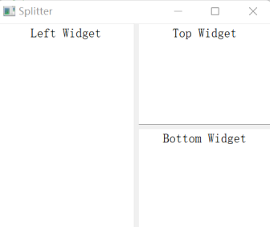

# Qt5开发及实例
## cal_pie:计算圆周率

## DockWindow: 浮动窗口

## Example：修改用户基本信息

## UserInfo：展示用户信息

## PushButtonTest: 按钮

## Splitter：分割窗口

## StackedWidget：堆栈窗口

## Test：Qt Designer设计的ui

## TreeWindow：树形下拉框
